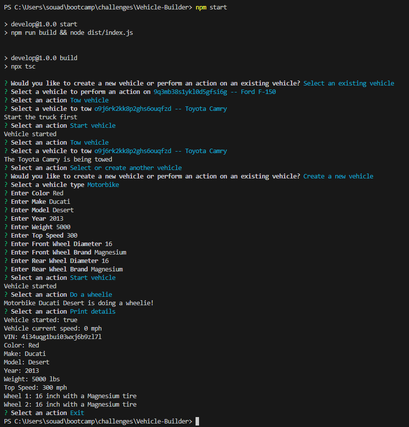

# Vehicle Builder
  

## Description

This command line application builds and uses cars to have additional options for motorbikes and trucks. This application prompts the user to create a new vehicle or select an existing vehicle. On whichever route the user chooses, a list of actions will be prompted.

## Table Of Contents

  - [Installation](#installation)
  - [Usage](#usage)
  - [License](#license)
  - [Demonstartion](#Demonstration)
  - [Questions](#questions)

## Installation

- Git clone the repository to your local machine.
- Install node.js.
- When you are under the directory locally, navigate to the command line and run "npm i" this should install all of the needed dependencies.

## Usage

- This application is invoked by running on the terminal the following comand: *npm start*. 
- The user will then be prompted of two choices: Either to *Create a new vehicle* or *Select an existing vehicle*. 
  - **Create a new vehicle**:
    - The user will be prompted to choose between: *Car*, *Motobike* and *Truck*.
    - The user will then be prompted for details about the chosen vehicle. and eventually enter all necessary information.
    - The user can then use the created vehicle to perform a list of actions that can consist of: 
      - Print Details, Start Vehicle, Accelerate 5 MPH, Decelerate 5 MPH, Stop vehicle, Turn right, Turn left, Reverse, Tow vehicle, Do a wheelie, Select or create another vehicle, or Exit.

  

  - **Select an existing vehicle**:
    - This choice will display all available vehicles, and the user needs to choose one. 
    - The user can then use the chosen existing vehicle to perform a list of actions that can consist of: 
      - Print Details, Start Vehicle, Accelerate 5 MPH, Decelerate 5 MPH, Stop vehicle, Turn right, Turn left, Reverse, Tow vehicle, Do a wheelie, Select or create another vehicle, or Exit.

  

## License

This project is licensed under the MIT License. To learn more about this means, click the license button at the top.  

## Demonstration

You can view this command line application on a demo video under this Link.

## Questions

GitHub Profile: https://github.com/Souad-Hb

If you have any additional questions, feel free to contact me at: souadsalahh@gmail.com 
